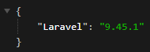

# SILAKEND - SERVER
## Tutorial Install
# Persiapan Aplikasi
1. Jalankan command `composer install` pada direktori projek.
2. Ubah file `.env.example` dengan nama `.env`.
3. Jalankan command `php artisan key:generate` pada direktori projek.
4. Pastikan tampilan projek pada browser seperti berikut:

# Persiapan Database
1. Sesuaikan value atribut `DB_DATABASE`, `DB_USERNAME`, dan `DB_PASSWORD` sesuai dengan konfigurasi pada server.
2. Jalankan command `php artisan migrate` pada direktori projek untuk membuat struktur database.
3. Jalankan command `php artisan db:seed` pada direktori projek untuk mengisi beberapa tabel dengan data awalan.